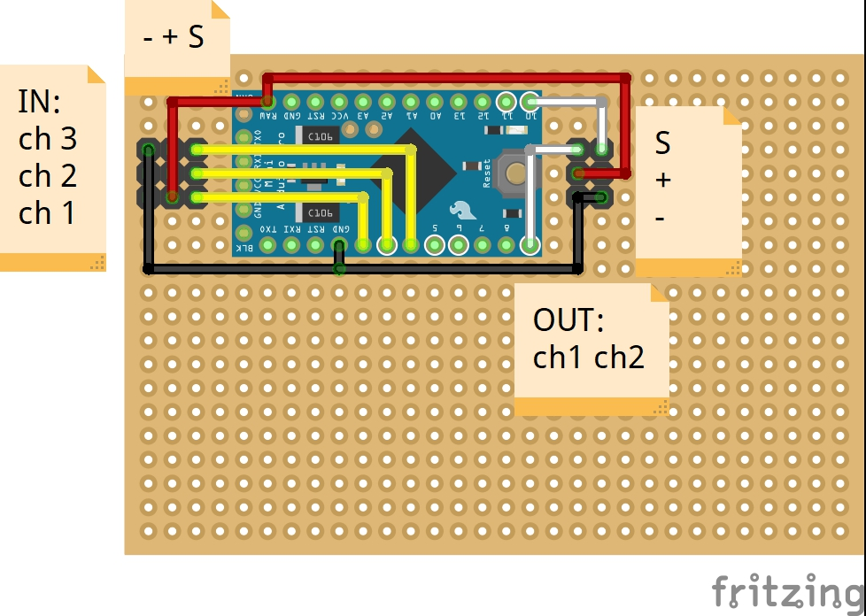

# Multiplexer

**Arduino Pro Mini 3.3v** is used as multiplexer instead of PWM Servo Module and RC Servo multiplexer.

- **Serial UART** is used to communicate with Nvidia Jetson Nano.

## Perfboard Wiring



## UART Connection for Nvidia Jetson Nano

Nvidia Jetson Nano | Arduino Pro Mini
------------------ | ----------------
J41 Pin 8 (TXD) -> | RX
J41 Pin 10 (RXD) -> | TX
J41 Pin 6 (GND) -> | GND

## GPIO and UART setup for Nvidia Jetson Nano

Run the following bash script to setup Jetson Nano for GPIO and UART.
```bash
# GPIO
sudo -H pip3 uninstall Jetson.GPIO
sudo -H pip3 install -U Jetson.GPIO
sudo groupadd -f -r gpio
sudo -S usermod -a -G gpio $USER
sudo cp /opt/nvidia/jetson-gpio/etc/99-gpio.rules /etc/udev/rules.d/
sudo udevadm control --reload-rules
sudo udevadm trigger

# UART
systemctl stop nvgetty
systemctl disable nvgetty
sudo udevadm trigger
sudo apt-get install python3-serial

sudo reboot

```

## Code

Arduino code for multiplexer is [here](multiplexer.ino).
